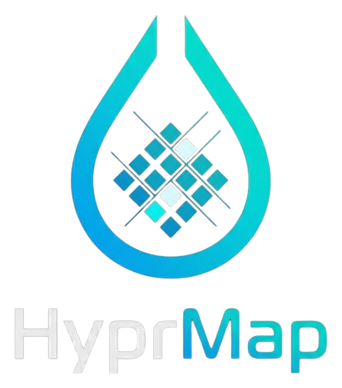
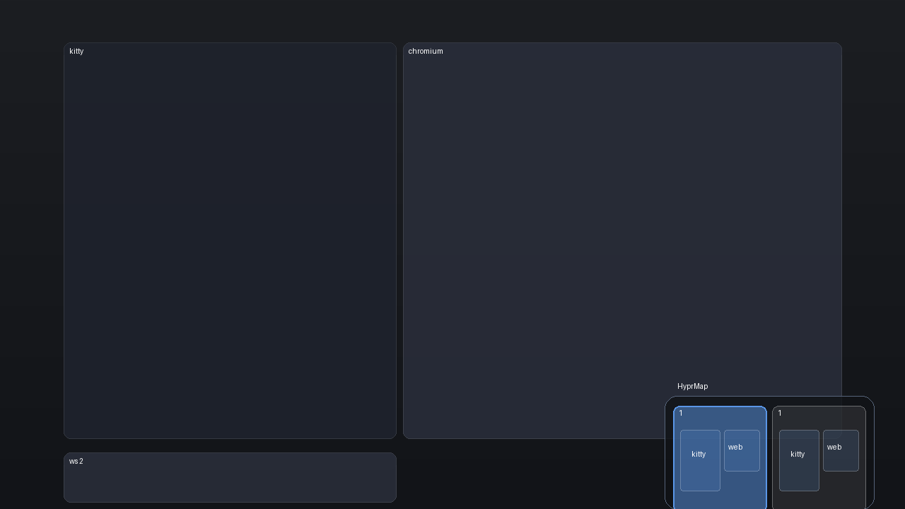
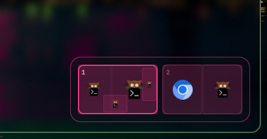

<p align="center">
  
</p>

<p align="center">
  <strong>A workspace minimap for Hyprland</strong>
</p>

<p align="center">
  
  
  
  
</p>

<p align="center">
  
</p>

<p align="center">
  
</p>

---

**HyprMap** draws a floating minimap in the bottom-right corner of your screen:
one rectangle per **occupied** workspace, subdivided by the *real* geometry of
every open window and stamped with each window's app icon. The active
workspace is highlighted. It is a purely visual, click-through overlay — it
never steals focus and never blocks clicks.

## Features

- **Real geometry** — window splits (2/3/4, columns, floats) are drawn exactly
  as they are laid out on each workspace.
- **Only occupied workspaces** — empty workspaces don't waste space.
- **App icons** — every window rect shows its application's icon from your icon
  theme (with a curated class→icon fallback map).
- **Active workspace highlight** — the focused workspace is outlined with the
  accent color.
- **Click-through** — an empty input region; the overlay can't block your
  desktop.
- **Live refresh** — window layout is re-polled every 700 ms while visible.
- **Works two ways**:
  - **Standalone** — plain Hyprland + [Quickshell](https://github.com/outfoxxed/quickshell)
    (no Omarchy needed). Ideal for Fedora, Arch and any distro using a vanilla
    Hyprland setup.
  - **Omarchy plugin** — native plugin for
    [Omarchy](https://omarchy.org) on Arch.

---

## Installation

### Option A — Standalone (any Hyprland: Fedora, Arch, …) *recommended*

This build only requires Hyprland + Quickshell and works on any distro. Pick
your distro below.

**1. Install the dependencies**

<details>
<summary>Fedora</summary>

```bash
# Hyprland (Fedora COPR)
sudo dnf copr enable solopasha/hyprland
sudo dnf install hyprland

# Quickshell (latest release from the official Quickshell COPR)
sudo dnf copr enable errornointernet/quickshell
sudo dnf install quickshell
#   Alternative: Fedora's own repo (older snapshot) — sudo dnf install quickshell

# An icon theme for the window logos (recommended)
sudo dnf install papirus-icon-theme
```
</details>

<details>
<summary>Arch</summary>

```bash
# Hyprland + Quickshell (official repos)
sudo pacman -S hyprland quickshell
#   Alternative: AUR for the dev branch — yay -S quickshell-git

# An icon theme for the window logos (recommended)
sudo pacman -S papirus-icon-theme
```
</details>

> **Note for Fedora**: Quickshell links Qt's private APIs, so after a Qt
> system update a previously installed Quickshell can crash. If that happens,
> just reinstall it (`sudo dnf reinstall quickshell`).

**2. Install HyprMap**

```bash
git clone https://github.com/Ricardo-Castro-Gastelum/HyprMap.git
cd HyprMap
./install.sh
```

**3. Autostart + keybinding**

Add to `~/.config/hypr/hyprland.conf`:

```ini
# Autostart the minimap (shown by default)
exec-once = quickshell -c hyprmap

# SUPER + M toggles the minimap
bind = SUPER, M, exec, quickshell ipc -c hyprmap call hyprmap toggle
```

Then run:

```bash
hyprctl reload
hyprctl dispatch exec quickshell -c hyprmap   # start it now (exec-once only runs on login)
```

> `hyprctl reload` makes the keybinding take effect right away, but
> `exec-once` only runs when you log in — the extra `hyprctl dispatch exec`
> line starts it immediately. On your next login it autostarts by itself.
>
> You can also copy the ready-made snippet
> [`standalone/hyprmap.hyprland.conf`](standalone/hyprmap.hyprland.conf) and
> `source` it from your main config.

### Option B — Omarchy plugin (Arch + Omarchy shell)

```bash
git clone https://github.com/Ricardo-Castro-Gastelum/HyprMap.git
cd HyprMap
./install.sh --omarchy

# then reload
hyprctl reload
omarchy-shell shell rescanPlugins
```

`install.sh --omarchy` copies the plugin, registers `hyprmap` in
`~/.config/omarchy/shell.json`, appends the `SUPER + M` binding to
`~/.config/hypr/bindings.lua` (backing both files up as `*.hyprmap.bak`), and
tells you to reload.

---

## Usage

| Action          | Key      |
|-----------------|----------|
| Toggle minimap  | `SUPER + M` |

Or run the toggle directly: **`hyprmap-toggle`** (standalone) /
**`omarchy-shell shell toggle hyprmap`** (Omarchy).

The minimap shows by default (standalone) and can be toggled at any time. It
only renders workspace rectangles for workspaces that currently have windows,
so an idle `SUPER + M` on an empty desktop shows nothing — that's by design.

---

## How it works

- Standalone: a Quickshell config (`quickshell -c hyprmap`) hosts a
  `PanelWindow` on the `Overlay` layer with an **empty input region**
  (`mask: Region {}` + `exclusionMode: Ignore`) — pure visuals.
- The model polls `hyprctl -j clients`, groups windows by workspace, filters
  out scratchpads and hidden clients, and normalizes each window's geometry to
  fractions of its workspace's bounding box.
- Icons resolve through your icon theme (`Quickshell.iconPath`) with a
  fallback mapping in `Model.js` for apps whose class doesn't match their icon
  name.

---

## Customization

Everything is configurable from the top of the QML file:

| Constant                    | File                      | Purpose |
|-----------------------------|---------------------------|---------|
| `boxW` / `boxH` / `boxSpacing` | `standalone/hyprmap.qml` | workspace box size & gap |
| `accent`, `cardBackground`, … | `standalone/hyprmap.qml` | colors |
| `refreshTimer.interval`       | `standalone/hyprmap.qml` | refresh rate |
| `FALLBACK_ICONS`              | `Model.js`               | class → icon name overrides |

The Omarchy build (`omarchy/hyprmap/Minimap.qml`) follows your Omarchy theme
automatically and exposes the same tuning constants.

---

## Troubleshooting

- **Not on screen?** The surface only appears when at least one window is
  open. Check with `hyprctl layers | grep hyprmap`.
- **No icons?** Install or switch an icon theme (e.g. `papirus-icon-theme`);
  HyprMap then shows generic placeholders.
- **Nothing toggles?** Confirm `quickshell` is in `$PATH`:
  `quickshell list --all` should show a `hyprmap` instance.
- **Another key already uses `SUPER + M`?** Change the `bind` line (or the
  `o.bind(...)` line for Omarchy) to a shortcut you prefer.
- **Logs:** `quickshell log` shows the running instance; QML errors from the
  overlay are printed there.

---

## Tested on

- Arch Linux · Hyprland 0.56.2 · Quickshell 0.3.1 (Omarchy plugin + standalone)
- Standalone build is tested on Quickshell 0.3 and should work on 0.2+ with
  Hyprland ≥ 0.40 (for Fedora, prefer the
  `errornointernet/quickshell` COPR to get the latest release).

---

## License

[MIT](LICENSE) — Copyright © 2026 Ricardo Castro Gastelum